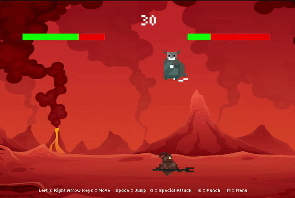
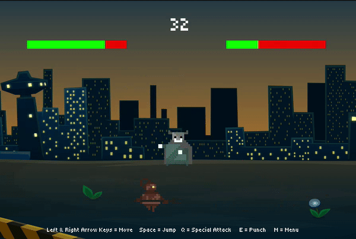

# PVP with Bot - Brendon So

# Intro
Hello! In this game, Players can select their fighter & choose a background before fighting against a bot opponent that is programmed with multiple behaviors and strategies. 

**Fighting with the Bot**
  

  
**After the match, the menu lets players select their map and fighter**
  


**New Map & Fighter selected**



# Features
- **Bot Behavior**: The bot has its own set of movements and attack strategies seperate from the opponents inputs, and is influenced by its health and proximity to the opponent. For example, in "ninja" mode, the bot retreats but counterattacks if the opponent distance is close by jumping behind the player for a sneak attack.
- **Player Class Design**: The Player class handles avatar selection, animations, and data like its state and health. Designed as a separate object from input handling, it is used in both the player and bot
- **Menu/Stats**: Players can select their fighter, and choose background through the menu. During gameplay, stats keep players informed about the match's progress and sends feedback about the games state.

# Installation
**Clone or download**
```bash
git clone https://github.com/brendonso/PlayerVsBot.git
```
**To run this game, it requires you to install the SFML library.** 
```bash
sudo apt-get install libsfml-dev
```
**Compile in the projects folder**
```bash
make
```
**Run**
```bash
./Fight
```
